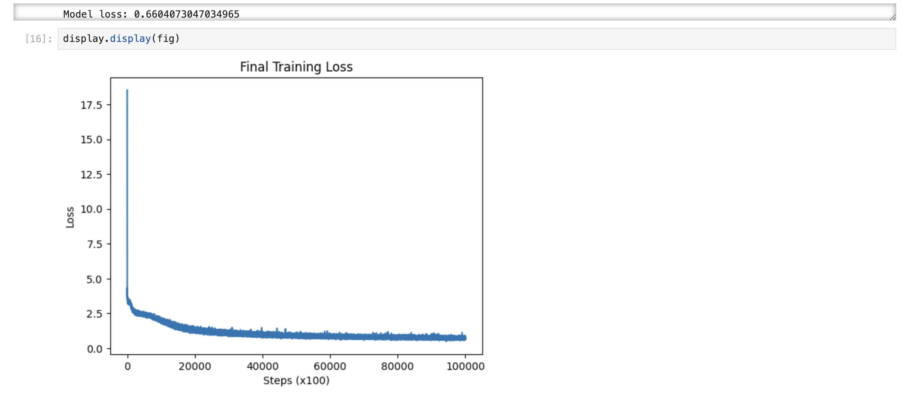
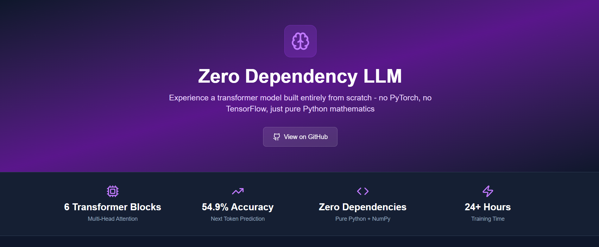
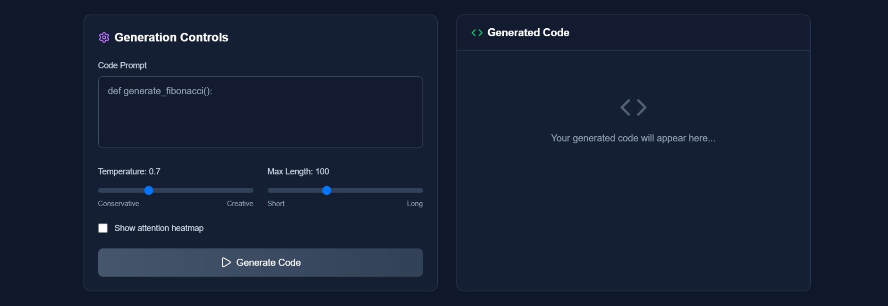
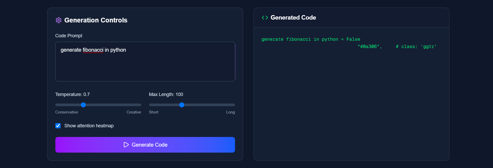
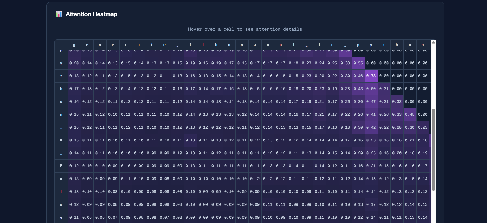

# Zero Dependency LLM

A complete implementation of a Large Language Model built from the ground up without external deep learning frameworks like PyTorch or TensorFlow. This project demonstrates a deep understanding of transformer architecture and modern NLP techniques through pure Python implementation.

## 🎯 Project Overview

This project implements a state-of-the-art transformer-based language model using only NumPy and basic Python libraries. The goal was to understand the intricate details of LLM architecture by building every component from scratch, including self-attention mechanisms, positional encodings, and advanced training techniques.

### Key Features

- **Pure Python Implementation**: No PyTorch, TensorFlow, or similar frameworks
- **Multi-Head Self-Attention**: 8-head attention mechanism per transformer block
- **Advanced Training Techniques**: LoRA (Low-rank Adaptation) and learning rate decay
- **Interactive Web Interface**: Next.js frontend with real-time generation and attention visualization
- **Attention Heatmaps**: Visual representation of model attention patterns

## 🏗️ Architecture

### Model Structure
The model follows the transformer architecture outlined in "Attention is All You Need" (Vaswani et al., 2017):

- **6 Transformer Blocks**: Each containing multi-head self-attention and feed-forward layers
- **Multi-Head Attention**: 8 attention heads per transformer block
- **Layer Normalization**: Applied before attention and feed-forward layers
- **Residual Connections**: Skip connections around each sub-layer
- **Position Embeddings**: Learned positional encodings for sequence modeling
- **ReLU Activation**: Non-linear activation in feed-forward networks

### Training Details
- **Dataset**: Python `requests` library source code (~10,000 lines)
- **Training Time**: 24+ hours on standard hardware
- **Final Loss**: Cross-entropy loss of 0.6 (≈54.9% next-token accuracy)
- **Optimization**: Custom implementation with cosine and linear learning rate decay

## 📊 Results

The model achieved a cross-entropy loss of **0.6**, which translates to approximately **54.9%** accuracy in predicting the next character in a sequence (calculated as e^(-0.6)).

### Training Progress


## 🌐 Web Interface

Built with Next.js, the interactive interface allows users to:
- Generate text with adjustable temperature and length parameters
- Visualize attention patterns through heatmaps
- Experiment with different prompts in real-time

### Interface Screenshots






## 🚀 Quick Start

### Prerequisites
- Python 3.8+
- Node.js 16+
- Jupyter Notebook
- NumPy, matplotlib (see requirements.txt)

### Installation

1. **Clone the repository**
   ```bash
   git clone https://github.com/akashdewangan/zero-dependency-llm.git
   cd zero-dependency-llm
   ```

2. **Set up the core Python environment**
   ```bash
   cd core
   pip install -r requirements.txt  # Install Python dependencies
   ```

3. **Set up the frontend**
   ```bash
   cd client
   npm install
   ```

### Usage

#### Training/Inference Notebooks

Navigate to the core directory and start Jupyter Notebook:
```bash
cd core
jupyter notebook
```

**Available notebooks:**
- `notebooks/lora.ipynb` - Pre-loaded with trained weights, includes LoRA implementation
- `notebooks/model.ipynb` - Base model training from scratch

*Note: To use the base model without LoRA, simply skip the cell that replaces W_query and W_value layers with LoRALayer.*

#### Gradio Web App

Launch the Gradio interface for model interaction:
```bash
cd core
python app.py
```

#### Next.js Frontend

Launch the Next.js development server:
```bash
cd client
npm run dev
```

Access the interface at `http://localhost:3000`

## 🔬 Technical Implementation

### Core Components
- **Attention Mechanism**: Multi-head scaled dot-product attention
- **Position Encoding**: Learnable position embeddings
- **Layer Normalization**: Custom implementation for training stability
- **LoRA Integration**: Low-rank adaptation for efficient fine-tuning
- **Custom Optimizers**: Learning rate scheduling with cosine/linear decay

### Model Deployment
The trained model can be deployed using the included Gradio app (`core/app.py`) or the Next.js frontend. Pre-trained weights are available in the `core/models/` directory.

## 📁 Project Structure

```
zero-dependency-llm/
├── client/                    # Next.js frontend application
│   ├── .gitignore
│   ├── app/                  # Next.js 13+ app directory
│   │   ├── favicon.ico
│   │   ├── globals.css       # Global styles
│   │   ├── layout.tsx        # Root layout component
│   │   └── page.tsx          # Main page component
│   ├── components/           # React components
│   │   ├── ControlPanel.tsx
│   │   ├── Header.tsx
│   │   ├── HeatMap/
│   │   │   ├── HeatMap.tsx
│   │   │   └── index.ts
│   │   ├── HeatmapDisplay.tsx
│   │   ├── OutputDisplay.tsx
│   │   └── Stats.tsx
│   ├── lib/
│   │   └── model.ts          # Model interface logic
│   ├── next-env.d.ts
│   ├── next.config.ts
│   ├── package-lock.json
│   ├── package.json
│   ├── postcss.config.mjs
│   ├── public/               # Static assets
│   │   ├── file.svg
│   │   ├── globe.svg
│   │   ├── icon.png
│   │   ├── next.svg
│   │   └── window.svg
│   └── tsconfig.json
├── core/                     # Python backend and model logic
│   ├── app.py                # Gradio web application
│   ├── data/                 # Training datasets
│   │   ├── python_fundamentals.txt
│   │   └── requests.txt      # Main training data
│   ├── models/               # Saved model weights
│   │   ├── lora_weights.npz  # LoRA adaptation weights
│   │   └── my_model.npz      # Base model weights
│   ├── notebooks/            # Jupyter notebooks
│   │   ├── lora.ipynb        # LoRA implementation
│   │   └── model.ipynb       # Base model training
│   ├── vocab.json            # Vocabulary mapping
│   └── Dockerfile            # Container deployment
└── images/                   # README screenshots
    ├── ss1.png              # Training progress
    ├── ss2.png              # Main interface
    ├── ss3.png              # Generation controls
    └── ss4.png              # Generated Code
    └── ss5.png              # Attention visualization
    └── ss6.png              # Attention Details
```

## 🎓 Learning Outcomes

This project provided hands-on experience with:
- Transformer architecture implementation
- Attention mechanism mathematics
- Gradient computation and backpropagation
- Advanced optimization techniques
- Model deployment and visualization
- Full-stack development for ML applications

## 🤝 Contributing

Contributions are welcome! Please feel free to submit issues, fork the repository, and create pull requests for any improvements.

---

**Built by akash dewangan.**
